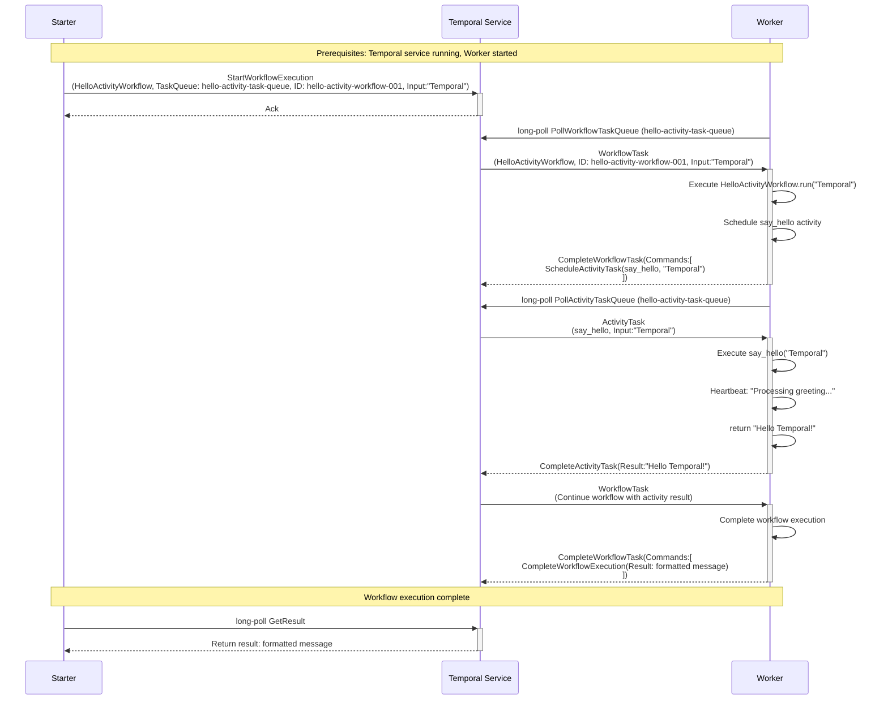

# Temporal Python Hello Activity Sample

This sample demonstrates Temporal workflow patterns using Python with activities. It shows how to:

- Define activities that perform business logic
- Create workflows that orchestrate activity calls
- Configure activity timeouts and retry policies
- Handle activity failures and retries

## Components

### 1. Activities (`activities.py`)
- **say_hello**: Generates a personalized greeting message with timestamp and simulated processing time
- Demonstrates activity heartbeat for long-running operations
- Shows proper logging and error handling patterns

### 2. Workflow (`workflow.py`)
- **HelloActivityWorkflow**: Orchestrates a call to the say_hello activity
- Demonstrates activity configuration (timeouts, retry policies)

### 3. Worker (`worker.py`)
- Connects to the Temporal service
- Registers both the workflow and activity
- Polls the `hello-activity-task-queue` for both workflow and activity tasks
- Can execute workflow orchestration and activity business logic

### 4. Starter (`starter.py`)
- Creates a Temporal client connection
- Starts a new workflow execution with ID `hello-activity-workflow-001`
- Waits for workflow completion and prints the result

## Sequence Diagram

The following diagram shows the interaction flow between components:

## Documentation Index

This sample includes several documentation files explaining different aspects of Temporal activity execution:

### 📚 Core Documentation
- **[Setup and Running Guide](setup-and-running.md)** - Step-by-step instructions for running this sample
- **[Activity Failure Scenarios](activity-failure-scenarios.md)** - Analysis of activity-specific failure scenarios and how Temporal handles them

### 🚀 Quick Start
To run this sample immediately, see the **[Setup and Running Guide](setup-and-running.md)**.

## Key Concepts Demonstrated

### Activity Definition
- **Activity Decorator**: `@activity.defn` marks functions as Temporal activities
- **Heartbeat**: `activity.heartbeat()` for long-running operations
- **Input/Output**: Activities receive parameters and return results

### Workflow Orchestration
- **Activity Execution**: `workflow.execute_activity()` to call activities
- **Single Arguments**: Pass single argument directly: `workflow.execute_activity(activity_fn, arg)`
- **Timeout Configuration**: `start_to_close_timeout` for activity execution limits
- **Retry Policies**: Configure retry behavior for failed activities
- **Deterministic vs Non-Deterministic**: Workflows handle orchestration, activities handle business logic

### Worker Registration
- **Multiple Registration**: Workers can register both workflows and activities
- **Task Queue Polling**: Single worker polls for both workflow and activity tasks
- **Concurrent Execution**: Worker can handle multiple workflow and activity instances

### Activity Benefits
- **Fault Tolerance**: Activities can fail and retry without affecting workflow state
- **External Interactions**: Activities can call external APIs, databases, etc.
- **Resource Management**: Activities can be distributed across different workers
- **Timeout Protection**: Activities have built-in timeout protection