# Temporal Activity Failure Scenarios

This document explains activity-specific failure scenarios in Temporal workflow execution. Activities have different failure characteristics than workflows because they handle external interactions and can be non-deterministic.

## Activity vs Workflow Failures

**Key Differences:**
- **Activities**: Can fail, retry, and be executed multiple times
- **Workflows**: Are deterministic and replay from history
- **Activities**: Handle external system interactions (APIs, databases, file systems)
- **Workflows**: Handle orchestration logic only

## Scenario 1: Activity Timeout

### Description

Activities have configurable timeouts to prevent them from running indefinitely. This scenario occurs when an activity takes longer than its configured timeout period.

### Sequence Diagram


### Temporal Behavior

**What Happens:**
1. **Timeout Detection**: Temporal tracks activity execution time against `start_to_close_timeout`
2. **Automatic Failure**: Activity task is marked as failed when timeout is exceeded
3. **Retry Logic**: Retry policy determines if activity should be retried
4. **Worker Handling**: Worker may still be processing the original task (which gets ignored)

**Configuration:**
```python
from temporalio.common import RetryPolicy

# Single argument activity
await workflow.execute_activity(
    say_hello,
    name,
    start_to_close_timeout=timedelta(seconds=30),  # Activity timeout
    retry_policy=RetryPolicy(
        initial_interval=timedelta(seconds=1),
        maximum_interval=timedelta(seconds=10),
        maximum_attempts=3,
    ),
)

# Multiple arguments activity
await workflow.execute_activity(
    format_message,
    args=[greeting, timestamp],  # Multiple args as list
    start_to_close_timeout=timedelta(seconds=15),
    retry_policy=RetryPolicy(
        initial_interval=timedelta(seconds=1),
        maximum_attempts=2,
    ),
)
```

---

## Scenario 2: Activity Worker Unavailable

### Description

This scenario occurs when an activity is scheduled but no worker is available to execute it, or all workers are busy with other activities.

### Sequence Diagram


### Temporal Behavior

**What Happens:**
1. **Task Queuing**: Activity tasks wait in the task queue for available workers
2. **Schedule-to-Start Timeout**: Optional timeout for how long task can wait in queue
3. **Worker Availability**: Tasks are dispatched when workers become available
4. **No Data Loss**: Activity tasks persist until executed or timeout

**Configuration:**
```python
from temporalio.common import RetryPolicy

await workflow.execute_activity(
    say_hello,
    name,
    schedule_to_start_timeout=timedelta(minutes=5),  # Queue timeout
    start_to_close_timeout=timedelta(seconds=30),    # Execution timeout
    retry_policy=RetryPolicy(
        initial_interval=timedelta(seconds=1),
        maximum_attempts=3,
    ),
)
```

---

## Scenario 3: Activity Exception/Failure

### Description

This scenario occurs when an activity function throws an exception or fails during execution due to business logic errors, external system failures, or programming errors.

### Sequence Diagram



```mermaid
sequenceDiagram
    participant S as Starter
    participant TS as Temporal Service
    participant W as Worker
    participant EXT as External System
    
    S->>+TS: StartWorkflowExecution (HelloActivityWorkflow)
    TS-->>-S: Ack
    
    W->>+TS: long-poll PollWorkflowTaskQueue
    TS->>+W: WorkflowTask (Schedule say_hello activity)
    W-->>-TS: CompleteWorkflowTask(Commands: [ScheduleActivityTask])
    
    W->>+TS: long-poll PollActivityTaskQueue
    TS->>+W: ActivityTask (say_hello)
    
    W->>W: Execute say_hello("Temporal")
    W->>+EXT: Call external API for greeting data
    
    rect rgb(255, 200, 200)
        EXT-->>-W: 💥 API Error: 500 Internal Server Error
        W->>W: Exception: requests.HTTPError
    end
    
    W-->>-TS: CompleteActivityTask(FAILED)<br/>Error: "API call failed: 500 Internal Server Error"
    
    Note over TS: Activity task marked as FAILED
    
    rect rgb(240, 255, 240)
        Note over TS: Retry Policy Evaluation<br/>Attempt 1 failed, retry scheduled
        
        TS->>TS: Wait initial_interval (1 second)
        TS->>TS: Schedule activity retry (Attempt 2)
        
        TS->>+W: ActivityTask (say_hello, Attempt: 2)
        W->>W: Execute say_hello("Temporal") - Retry
        W->>+EXT: Call external API (retry)
        EXT-->>-W: 💥 Still failing: 503 Service Unavailable
        W-->>-TS: CompleteActivityTask(FAILED)<br/>Error: "API call failed: 503 Service Unavailable"
        
        TS->>TS: Wait backoff interval (2 seconds)
        TS->>TS: Schedule activity retry (Attempt 3 - Final)
        
        TS->>+W: ActivityTask (say_hello, Attempt: 3)
        W->>W: Execute say_hello("Temporal") - Final Retry
        W->>+EXT: Call external API (final attempt)
        EXT-->>-W: ✅ 200 OK: Success!
        W-->>-TS: CompleteActivityTask(Result: "Hello Temporal!")
    end
    
    TS->>+W: WorkflowTask (Continue workflow)
    W->>W: Complete workflow with successful result
    W-->>-TS: CompleteWorkflowTask(Commands: [CompleteWorkflowExecution])
    
    Note over S,W: Workflow completed after activity retries
```

### Activity Code with Error Handling

```python
@activity.defn
async def say_hello(name: str) -> str:
    """Activity with proper error handling and retries."""
    logger.info(f"Activity started: generating greeting for '{name}' (Attempt: {activity.info().attempt})")
    
    try:
        # Simulate external API call that might fail
        response = await call_external_greeting_api(name)
        return f"Hello {response.greeting}!"
        
    except requests.HTTPError as e:
        logger.error(f"API call failed: {e}")
        # Re-raise to trigger retry
        raise
        
    except Exception as e:
        logger.error(f"Unexpected error: {e}")
        # Could handle specific exceptions differently
        raise
```

---

## Scenario 4: Activity Heartbeat Timeout

### Description

For long-running activities, heartbeat timeouts occur when an activity stops sending heartbeat signals, indicating it may be stuck or crashed.

### Sequence Diagram


### Heartbeat Configuration

```python
@activity.defn
async def long_running_activity(data: str) -> str:
    """Long-running activity with proper heartbeat."""
    
    for i in range(100):  # Long processing loop
        # Do some work
        await process_chunk(data, i)
        
        # Send heartbeat every 10 iterations
        if i % 10 == 0:
            activity.heartbeat(f"Processing chunk {i}/100")
    
    return "Processing completed!"

# Workflow configuration
from temporalio.common import RetryPolicy

await workflow.execute_activity(
    long_running_activity,
    data,
    start_to_close_timeout=timedelta(minutes=10),
    heartbeat_timeout=timedelta(seconds=30),  # Heartbeat timeout
    retry_policy=RetryPolicy(
        initial_interval=timedelta(seconds=2),
        maximum_attempts=2,
    ),
)
```

---

## Activity Failure Best Practices

### 1. Timeout Configuration
- **start_to_close_timeout**: Total time activity can run
- **schedule_to_start_timeout**: Time activity can wait in queue
- **heartbeat_timeout**: Time between required heartbeats

### 2. Retry Policies
- **initial_interval**: First retry delay
- **maximum_interval**: Maximum retry delay (with exponential backoff)
- **maximum_attempts**: Total retry attempts
- **non_retryable_error_types**: Exceptions that shouldn't retry

### 3. Error Handling
- **Specific Exceptions**: Handle different error types appropriately
- **Logging**: Log activity progress and errors
- **Graceful Degradation**: Provide fallback behavior when possible

### 4. Heartbeat Management
- **Long Operations**: Send heartbeats for activities > 30 seconds
- **Progress Updates**: Include meaningful progress information
- **Regular Intervals**: Send heartbeats at consistent intervals

### 5. Resource Management
- **Connection Pooling**: Reuse database/API connections
- **Cleanup**: Properly clean up resources in finally blocks
- **Idempotency**: Design activities to be safely retryable

## Key Takeaways

1. **Activities Fail Differently**: Activities can fail and retry independently of workflows
2. **Timeout Protection**: Multiple timeout types protect against different failure modes
3. **Automatic Retries**: Retry policies handle transient failures automatically
4. **Heartbeat Monitoring**: Heartbeats detect hung or crashed activity workers
5. **External System Integration**: Activities are designed to handle external system failures
6. **Resource Isolation**: Activity failures don't corrupt workflow state

Understanding activity failure scenarios is crucial for building resilient Temporal applications that can handle external system failures gracefully.