```mermaid
sequenceDiagram
    participant S as Starter
    participant TS as Temporal Service
    participant W as Worker
    participant EXT as External System
    
    S->>+TS: StartWorkflowExecution (HelloActivityWorkflow)
    TS-->>-S: Ack
    
    W->>+TS: long-poll PollWorkflowTaskQueue
    TS->>+W: WorkflowTask (Schedule say_hello activity)
    W-->>-TS: CompleteWorkflowTask(Commands: [ScheduleActivityTask])
    
    W->>+TS: long-poll PollActivityTaskQueue
    TS->>+W: ActivityTask (say_hello)
    
    W->>W: Execute say_hello("Temporal")
    W->>+EXT: Call external API for greeting data
    
    rect rgb(255, 200, 200)
        EXT-->>-W: 💥 API Error: 500 Internal Server Error
        W->>W: Exception: requests.HTTPError
    end
    
    W-->>-TS: CompleteActivityTask(FAILED)<br/>Error: "API call failed: 500 Internal Server Error"
    
    Note over TS: Activity task marked as FAILED
    
    rect rgb(240, 255, 240)
        Note over TS: Retry Policy Evaluation<br/>Attempt 1 failed, retry scheduled
        
        TS->>TS: Wait initial_interval (1 second)
        TS->>TS: Schedule activity retry (Attempt 2)
        
        TS->>+W: ActivityTask (say_hello, Attempt: 2)
        W->>W: Execute say_hello("Temporal") - Retry
        W->>+EXT: Call external API (retry)
        EXT-->>-W: 💥 Still failing: 503 Service Unavailable
        W-->>-TS: CompleteActivityTask(FAILED)<br/>Error: "API call failed: 503 Service Unavailable"
        
        TS->>TS: Wait backoff interval (2 seconds)
        TS->>TS: Schedule activity retry (Attempt 3 - Final)
        
        TS->>+W: ActivityTask (say_hello, Attempt: 3)
        W->>W: Execute say_hello("Temporal") - Final Retry
        W->>+EXT: Call external API (final attempt)
        EXT-->>-W: ✅ 200 OK: Success!
        W-->>-TS: CompleteActivityTask(Result: "Hello Temporal!")
    end
    
    TS->>+W: WorkflowTask (Continue workflow)
    W->>W: Complete workflow with successful result
    W-->>-TS: CompleteWorkflowTask(Commands: [CompleteWorkflowExecution])
    
    Note over S,W: Workflow completed after activity retries
```

# Temporal Activity Failure Scenarios

This document explains activity-specific failure scenarios in Temporal workflow execution. Activities have different failure characteristics than workflows because they handle external interactions and can be non-deterministic.

## Activity vs Workflow Failures

**Key Differences:**
- **Activities**: Can fail, retry, and be executed multiple times
- **Workflows**: Are deterministic and replay from history
- **Activities**: Handle external system interactions (APIs, databases, file systems)
- **Workflows**: Handle orchestration logic only

## Scenario 1: Activity Timeout

### Description

Activities have configurable timeouts to prevent them from running indefinitely. This scenario occurs when an activity takes longer than its configured StartToCloseTimeout. Note that Temporal doesn't detect worker hangs and restarts directly, it relies on timeouts for failure detection.

### Sequence Diagram


### Temporal Behavior

**What Happens:**
1. **Timeout Detection**: Temporal tracks activity execution time against `start_to_close_timeout`
2. **Automatic Failure**: Activity task is marked as failed when timeout is exceeded
3. **Retry Logic**: Retry policy determines if activity should be retried
4. **Worker Handling**: Worker may still be processing the original task (which gets ignored)

**Configuration:**
```python
from temporalio.common import RetryPolicy

await workflow.execute_activity(
    say_hello,
    name,
    start_to_close_timeout=timedelta(seconds=30),  # Activity timeout
    retry_policy=RetryPolicy(
        initial_interval=timedelta(seconds=1),
        maximum_interval=timedelta(seconds=10),
        maximum_attempts=3,
    ),
)
```

---

## Scenario 2: Activity Worker Unavailable

### Description

This scenario occurs when an activity is scheduled but no worker is available to execute it, or all workers are busy with other activities.

### Sequence Diagram


### Temporal Behavior

**What Happens:**
1. **Task Queuing**: Activity tasks wait in the task queue for available workers
2. **Schedule-to-Start Timeout**: Optional timeout for how long task can wait in queue. This timeout is not retryable as retry would just put the task back into the same queue.
3. **Worker Availability**: Tasks are dispatched when workers become available
4. **No Data Loss**: Activity tasks persist until executed or timeout

**Configuration:**
```python
from temporalio.common import RetryPolicy

await workflow.execute_activity(
    say_hello,
    name,
    schedule_to_start_timeout=timedelta(minutes=5),  # Queue timeout
    start_to_close_timeout=timedelta(seconds=30),    # Execution timeout
    retry_policy=RetryPolicy(
        initial_interval=timedelta(seconds=1),
        maximum_attempts=3,
    ),
)
```

---
## Scenario 3: Activity Exception/Failure

### Description

This scenario occurs when an activity function throws an exception or fails during execution due to business logic errors, external system failures, or programming errors.

### Sequence Diagram


---
## Activity Failure Best Practices

### 1. Timeout Configuration
- **start_to_close_timeout**: Total time a single activity task can run
- **schedule_to_start_timeout**: Time activity can wait in a task queue queue
- **schedule_to_close_timeout**: Total time allowed for activity execution. This includes total queueing and execution time for all the retries.

### 2. Retry Policies
- **initial_interval**: First retry delay
- **maximum_interval**: Maximum retry delay (with exponential backoff)
- **maximum_attempts**: Total retry attempts
- **non_retryable_error_types**: Exceptions that shouldn't retry

### 5. Resource Management

## Key Takeaways

1. **Automatic Retries**: Retry policies handle transient failures automatically
2. **Idempotency**: Design activities to be safely retryable
2. **Timeout Protection**: Multiple timeout types protect against different failure modes
