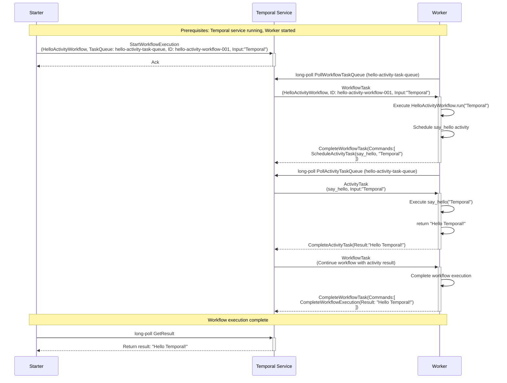

# Temporal Activity Workflow History Events

This document explains the relationship between activity workflow execution flow and the history events that Temporal generates. Understanding workflow history with activities is crucial for debugging, monitoring, and understanding how Temporal tracks both workflow orchestration and activity execution.

## Basic Activity Workflow Execution Flow

Here's the sequence diagram showing our HelloActivity workflow execution:



## Event Definitions Source

All Temporal history events are formally defined in the Temporal API protobuf definitions. The complete source of truth for all event types, their attributes, and structure can be found at:

**[https://github.com/temporalio/api/blob/master/temporal/api/history/v1/message.proto](https://github.com/temporalio/api/blob/master/temporal/api/history/v1/message.proto)**

This protobuf file contains the canonical definitions for all history event types, including the specific attributes and data structures used in each event. When working with history events programmatically or debugging workflow issues, this file serves as the authoritative reference.

## History Events Generated

For each step in the sequence diagram above, Temporal generates corresponding history events. Here's the complete history for our HelloActivity workflow execution:

### Event 1: WorkflowExecutionStarted
**Triggered by:** `StartWorkflowExecution` call from Starter

```json
{
  "eventId": 1,
  "eventType": "WorkflowExecutionStarted",
  "timestamp": "2024-01-15T10:00:00Z",
  "workflowExecutionStartedEventAttributes": {
    "workflowType": {
      "name": "HelloActivityWorkflow"
    },
    "taskQueue": {
      "name": "hello-activity-task-queue"
    },
    "input": {
      "payloads": [
        {
          "data": "\"Temporal\""
        }
      ]
    },
    "workflowExecutionTimeout": "0s",
    "workflowRunTimeout": "0s",
    "workflowTaskTimeout": "10s",
    "originalExecutionRunId": "run-id-123",
    "identity": "starter-client@hostname",
    "firstExecutionRunId": "run-id-123"
  }
}
```

**What it means:** This event records that a new workflow execution has been started with all the initial parameters.

### Event 2: WorkflowTaskScheduled
**Triggered by:** Temporal Service creating the first workflow task. This happens atomically as part of `StartWorkflowExecution` call.

```json
{
  "eventId": 2,
  "eventType": "WorkflowTaskScheduled",
  "timestamp": "2024-01-15T10:00:00.001Z",
  "workflowTaskScheduledEventAttributes": {
    "taskQueue": {
      "name": "hello-activity-task-queue"
    },
    "startToCloseTimeout": "10s",
    "attempt": 1
  }
}
```

**What it means:** Temporal has created a workflow task and scheduled it on the specified task queue, waiting for a worker to pick it up.

### Event 3: WorkflowTaskStarted
**Triggered by:** Worker polling and receiving the workflow task

```json
{
  "eventId": 3,
  "eventType": "WorkflowTaskStarted",
  "timestamp": "2024-01-15T10:00:01Z",
  "workflowTaskStartedEventAttributes": {
    "scheduledEventId": 2,
    "identity": "worker@hostname-12345",
    "requestId": "request-uuid-456"
  }
}
```

**What it means:** A worker has picked up the workflow task and started processing it. The `scheduledEventId` references Event 2. Worker identity might be extremely useful for troubleshooting.

### Event 4: WorkflowTaskCompleted
**Triggered by:** Worker completing the workflow task and sending commands

```json
{
  "eventId": 4,
  "eventType": "WorkflowTaskCompleted",
  "timestamp": "2024-01-15T10:00:01.100Z",
  "workflowTaskCompletedEventAttributes": {
    "scheduledEventId": 2,
    "startedEventId": 3,
    "identity": "worker@hostname-12345",
    "binaryChecksum": "checksum-abc123"
  }
}
```

**What it means:** The worker has successfully processed the workflow task and submitted commands (in this case, a command to schedule an activity task).

### Event 5: ActivityTaskScheduled
**Triggered by:** Worker's ScheduleActivityTask command. This event is written atomically with `WorkflowTaskCompleted`.

```json
{
  "eventId": 5,
  "eventType": "ActivityTaskScheduled",
  "timestamp": "2024-01-15T10:00:01.101Z",
  "activityTaskScheduledEventAttributes": {
    "activityId": "activity-1",
    "activityType": {
      "name": "say_hello"
    },
    "taskQueue": {
      "name": "hello-activity-task-queue"
    },
    "input": {
      "payloads": [
        {
          "data": "\"Temporal\""
        }
      ]
    },
    "scheduleToCloseTimeout": "30s",
    "scheduleToStartTimeout": "10s",
    "startToCloseTimeout": "30s",
    "heartbeatTimeout": "0s",
    "workflowTaskCompletedEventId": 4,
    "retryPolicy": {
      "initialInterval": "1s",
      "maximumInterval": "10s",
      "maximumAttempts": 3
    }
  }
}
```

**What it means:** An activity task has been scheduled for execution with the specified configuration and retry policy.

### Event 6: ActivityTaskStarted
**Triggered by:** Worker polling and receiving the activity task

```json
{
  "eventId": 6,
  "eventType": "ActivityTaskStarted",
  "timestamp": "2024-01-15T10:00:02Z",
  "activityTaskStartedEventAttributes": {
    "scheduledEventId": 5,
    "identity": "worker@hostname-12345",
    "requestId": "request-uuid-789",
    "attempt": 1
  }
}
```

**What it means:** A worker has picked up the activity task and started executing the activity function. Note the attempt field. If the activity was retried before completing succesfully the value will be more than 1.

### Event 7: ActivityTaskCompleted
**Triggered by:** CompleteActivityTask call.

```json
{
  "eventId": 7,
  "eventType": "ActivityTaskCompleted",
  "timestamp": "2024-01-15T10:00:04Z",
  "activityTaskCompletedEventAttributes": {
    "result": {
      "payloads": [
        {
          "data": "\"Hello Temporal!\""
        }
      ]
    },
    "scheduledEventId": 5,
    "startedEventId": 6,
    "identity": "worker@hostname-12345"
  }
}
```

**What it means:** The activity has completed successfully and returned a result. This triggers the next workflow task.

### Event 8: WorkflowTaskScheduled
**Triggered by:** Activity completion triggering workflow continuation.  This happens atomically as part of the CompleteActivityTask call.

```json
{
  "eventId": 8,
  "eventType": "WorkflowTaskScheduled",
  "timestamp": "2024-01-15T10:00:04.001Z",
  "workflowTaskScheduledEventAttributes": {
    "taskQueue": {
      "name": "hello-activity-task-queue"
    },
    "startToCloseTimeout": "10s",
    "attempt": 1
  }
}
```

**What it means:** A new workflow task has been scheduled to continue the workflow with the activity result.

### Event 9: WorkflowTaskStarted
**Triggered by:** Worker receiving the continuation workflow task

```json
{
  "eventId": 9,
  "eventType": "WorkflowTaskStarted",
  "timestamp": "2024-01-15T10:00:05Z",
  "workflowTaskStartedEventAttributes": {
    "scheduledEventId": 8,
    "identity": "worker@hostname-12345",
    "requestId": "request-uuid-101"
  }
}
```

**What it means:** The worker has picked up the workflow task to continue execution with the activity result.

### Event 10: WorkflowTaskCompleted
**Triggered by:** Worker processing the activity result and completing the workflow

```json
{
  "eventId": 10,
  "eventType": "WorkflowTaskCompleted",
  "timestamp": "2024-01-15T10:00:05.100Z",
  "workflowTaskCompletedEventAttributes": {
    "scheduledEventId": 8,
    "startedEventId": 9,
    "identity": "worker@hostname-12345",
    "binaryChecksum": "checksum-abc123"
  }
}
```

**What it means:** The worker has processed the activity result and submitted a command to complete the workflow execution.

### Event 11: WorkflowExecutionCompleted
**Triggered by:** Worker's CompleteWorkflowExecution command. This event is written atomically with `WorkflowTaskCompleted`.

```json
{
  "eventId": 11,
  "eventType": "WorkflowExecutionCompleted",
  "timestamp": "2024-01-15T10:00:05.101Z",
  "workflowExecutionCompletedEventAttributes": {
    "result": {
      "payloads": [
        {
          "data": "\"Hello Temporal!\""
        }
      ]
    },
    "workflowTaskCompletedEventId": 10
  }
}
```

**What it means:** The workflow execution has completed successfully with the final result from the activity.

## Event Flow Mapping

Here's how each sequence diagram step maps to history events:

| Sequence Step | History Events Generated | Description |
|---------------|-------------------------|-------------|
| `StartWorkflowExecution` | **Event 1:** WorkflowExecutionStarted<br/>**Event 2:** WorkflowTaskScheduled | Workflow created and first task scheduled |
| `PollWorkflowTaskQueue` | *(No history event)* | Worker polling doesn't generate events |
| `WorkflowTask` delivered | **Event 3:** WorkflowTaskStarted | Worker receives and starts processing task |
| `Execute HelloActivityWorkflow.run()` | *(No history event during execution)* | Workflow code execution buffers commands locally |
| `CompleteWorkflowTask` (Schedule Activity) | **Event 4:** WorkflowTaskCompleted<br/>**Event 5:** ActivityTaskScheduled | Task completion and activity scheduling |
| `PollActivityTaskQueue` | *(No history event)* | Worker polling for activities doesn't generate events |
| `ActivityTask` delivered | **Event 6:** ActivityTaskStarted | Worker receives and starts executing activity |
| `Execute say_hello()` | *(No history event during execution)* | Activity code execution |
| `CompleteActivityTask` | **Event 7:** ActivityTaskCompleted<br/>**Event 8:** WorkflowTaskScheduled | Activity completion triggers workflow continuation |
| `WorkflowTask` (Continue) | **Event 9:** WorkflowTaskStarted | Worker receives continuation task |
| `CompleteWorkflowTask` (Final) | **Event 10:** WorkflowTaskCompleted<br/>**Event 11:** WorkflowExecutionCompleted | Final workflow completion |
| `GetResult` | *(No history event)* | Reading results doesn't generate events |

## Activity-Specific History Characteristics

### Activity Task Lifecycle
Activities generate their own set of history events that are separate from but coordinated with workflow events:

1. **ActivityTaskScheduled**: When workflow schedules an activity
2. **ActivityTaskStarted**: When worker begins executing the activity
3. **ActivityTaskCompleted/Failed/TimedOut**: When activity finishes (success or failure)

### Event Relationships in Activity Workflows
- **Activity Scheduling**: `ActivityTaskScheduled` references the `workflowTaskCompletedEventId` that scheduled it
- **Activity Execution**: `ActivityTaskStarted` references `scheduledEventId`
- **Activity Completion**: `ActivityTaskCompleted` references both `scheduledEventId` and `startedEventId`
- **Workflow Continuation**: New `WorkflowTaskScheduled` is triggered by activity completion

### Activity Retry Events
When activities fail and retry, additional events are generated:
- **ActivityTaskFailed**: Records the failure
- **ActivityTaskScheduled**: New attempt scheduled (with incremented attempt number)
- **ActivityTaskStarted**: Retry attempt begins
- **ActivityTaskCompleted**: Successful retry completion

## Viewing Activity History in Practice

### Using Temporal CLI
```bash
# View workflow history including activities
temporal workflow show \
  --workflow-id hello-activity-workflow-001 \
  --address localhost:7233
```

### Using Temporal Web UI
1. Navigate to http://localhost:8233
2. Find your workflow execution
3. Click on "History" tab to see all events
4. Activity events will show with activity icons and details
5. Click on individual activity events to see activity-specific information

### Using Python SDK
```python
from temporalio.client import Client

async def view_activity_history():
    client = await Client.connect("localhost:7233")
    handle = client.get_workflow_handle("hello-activity-workflow-001")
    
    # Get workflow history including activity events
    async for event in handle.fetch_history():
        print(f"Event {event.event_id}: {event.event_type}")
        print(f"  Timestamp: {event.event_time}")
        
        # Show activity-specific details
        if "Activity" in event.event_type:
            print(f"  Activity Details: {event}")
        print()
```

## Practical Applications

### Debugging Activities
- **Activity Failures**: `ActivityTaskFailed` events contain error details and stack traces
- **Timeout Issues**: `ActivityTaskTimedOut` events show which timeout was exceeded
- **Retry Analysis**: Multiple activity events show retry attempts and outcomes
- **Performance Analysis**: Timestamps show activity execution duration

### Monitoring Activity Workflows
- **Activity Progress**: Track individual activity execution stages
- **Failure Patterns**: Identify which activities fail most often
- **Performance Metrics**: Measure activity execution times vs workflow orchestration time
- **Resource Usage**: Monitor which workers execute which activities

### Activity Workflow Auditing
- **Complete Activity Trail**: Every activity execution is recorded
- **Input/Output Tracking**: Activity parameters and results are stored
- **Retry Forensics**: Complete record of retry attempts and reasons
- **Worker Identification**: Track which workers executed which activities

## Key Takeaways

1. **Activity Events Are Separate**: Activities generate their own history events independent of workflow events
2. **Event Coordination**: Activity events trigger workflow continuation events
3. **Complete Activity Audit**: Every activity execution, retry, and failure is recorded
4. **Rich Activity Metadata**: Activity events contain detailed configuration and execution information
5. **Debugging Power**: Activity history provides precise insight into business logic execution
6. **Performance Visibility**: Separate activity timing enables granular performance analysis

Understanding activity workflow history is essential for building robust, observable, and debuggable Temporal applications that use activities for business logic execution.