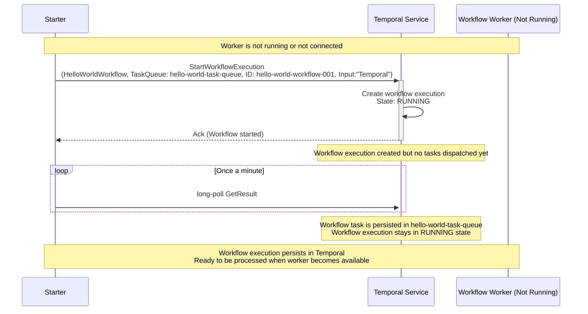
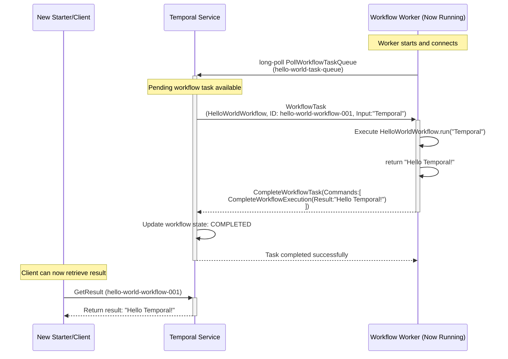

```mermaid
sequenceDiagram
    participant S as Starter
    participant TS as Temporal Service
    participant W as Workflow Worker
    
    Note over S,W: Normal workflow execution begins
    
    S->>+TS: StartWorkflowExecution<br/>(HelloWorldWorkflow, TaskQueue: hello-world-task-queue, ID: hello-world-workflow-002, Input:"Temporal")
    TS-->>-S: Ack
    
    W->>+TS: long-poll PollWorkflowTaskQueue<br/>(hello-world-task-queue)
    TS->>+W: WorkflowTask<br/>(HelloWorldWorkflow, ID: hello-world-workflow-002, Input:"Temporal")
    
    Note over W: Worker starts processing
    W->>W: Execute HelloWorldWorkflow.run("Temporal")
    
    rect rgb(255, 200, 200)
        Note over W: 💥 WORKER CRASHES<br/>Network disconnect, process kill, etc.
        W--X W: Worker becomes unresponsive
    end
    
    Note over TS: Task timeout timer running<br/>(default: 10 seconds for workflow tasks, exponential backoff in case of repeated failures)
    
    loop Task Timeout Period
        TS->>TS: Wait for task completion<br/>or worker heartbeat
        Note over TS: No response from worker
    end
    
    Note over TS: ⏰ Workflow Task Timeout<br/>Task marked as failed
    
    TS->>TS: Create new workflow task<br/>(same workflow execution)<br/>Attempt: 2, History: previous attempts
    
    rect rgb(240, 255, 240)
        Note over S,TS: Recovery: New worker or restarted worker
        
        participant W2 as Workflow Worker (Recovered)
        W2->>+TS: long-poll PollWorkflowTaskQueue<br/>(hello-world-task-queue)
        
        TS->>+W2: WorkflowTask<br/>(HelloWorldWorkflow, ID: hello-world-workflow-002, Input:"Temporal")<br/>Attempt: 2
        
        W2->>W2: Execute HelloWorldWorkflow.run("Temporal")
        W2->>W2: return "Hello Temporal!"
        W2-->>-TS: CompleteWorkflowTask(Commands:[<br/>CompleteWorkflowExecution(Result:"Hello Temporal!")<br/>])
        
        TS->>TS: Update workflow state: COMPLETED
        TS-->>-W2: Task completed successfully
    end
    
    S->>+TS: long-poll GetResult
    TS-->>-S: Return result: "Hello Temporal!"
    
    Note over S,W2: Workflow completed successfully<br/>despite worker crash
```

# Temporal Workflow Worker Failure Scenarios

This document explains two common failure scenarios in Temporal workflow execution and how the system handles them gracefully. Understanding these scenarios is crucial for building resilient Temporal applications.

## Scenario 1: No Workflow Worker Available

### Description

This scenario occurs when a workflow execution is started, but no worker is running to process the workflow tasks. This is common during:
- Initial application deployment before workers are started
- Worker downtime during maintenance or crashes
- Configuration mismatches between starter and worker task queues

### Sequence Diagram



### Temporal Behavior

**What Happens:**
1. **Workflow Creation**: The workflow execution is successfully created and stored in Temporal
2. **Task Queuing**: Workflow tasks wait in the task queue but aren't dispatched (no workers available)
3. **State Persistence**: The workflow remains in `RUNNING` state indefinitely if timeout is not specified or explictly canceled or terminated
4. **Client Timeout**: The starter may timeout (if configured) waiting for results, but the workflow persists. It is also possible to wait for result from a different process than started the workflow.

**Key Points:**
- **No Data Loss**: The workflow execution and its state are safely stored
- **Automatic Recovery**: When a worker becomes available, it will immediately pick up pending tasks
- **Client Flexibility**: Clients can reconnect later to get results
- **No Task Expiration**: Workflow tasks don't expire (the whole workfow can timeout if configured)

### Recovery

When a worker becomes available:



---

## Scenario 2: Workflow Worker Crashes During Task Processing

### Description

This scenario occurs when a worker crashes, becomes unresponsive, or loses connection while processing a workflow task. This can happen due to:
- Application crashes or bugs
- Network connectivity issues  
- Resource exhaustion (memory, CPU)
- Infrastructure failures

### Sequence Diagram



### Temporal Behavior

**What Happens:**
1. **Task Assignment**: Worker receives and starts processing the workflow task
2. **Worker Failure**: Worker crashes/disconnects during task processing
3. **Timeout Detection**: Temporal detects the failure via task timeout (default: 10 seconds)
4. **Task Retry**: A new workflow task is created
5. **Task Redelivered**: A different workflow woker picks up the task
6. **Successful Completion**: Workflow completes normally

**Key Points:**
- **Automatic Recovery**: No manual intervention required
- **At-Most-Once Execution**: From an external observer a workflow is executed exactly once
- **Workflow Task Timeout**: Configurable timeout for detecting worker failures. It is important to recogize that this timeout only affects retries of workfow tasks and is not related to the ovearll workflow timeout. It is not recommended to increase this timeout in the majority of cases.

### Task Timeout Configuration

You can configure workflow task timeouts:

```python
# In the starter
handle = await client.start_workflow(
    HelloWorldWorkflow.run,
    name_input,
    id=workflow_id,
    task_queue="hello-world-task-queue",
    task_timeout=timedelta(seconds=30),  # Custom timeout
)
```
