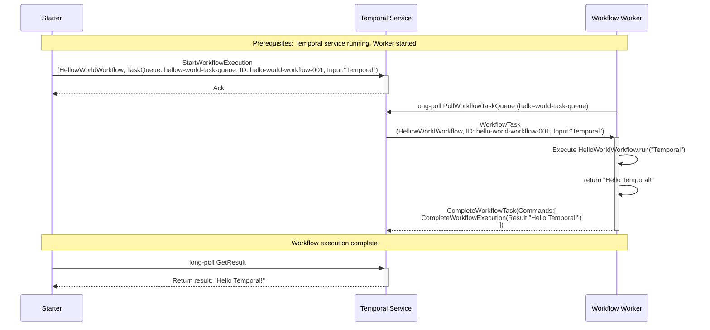

# Temporal Python Hello World Sample

This sample demonstrates the most basic Temporal workflow pattern using Python. It shows how to:

- Define a simple workflow that returns a greeting message
- Create a worker to execute workflows
- Start a workflow execution from a client

## Components

### 1. Workflow (`workflow.py`)
- **HelloWorldWorkflow**: A simple workflow class that returns a personalized greeting
- Demonstrates the basic `@workflow.defn` and `@workflow.run` decorators
- Takes a name parameter and returns "Hello {name}!" string

### 2. Worker (`worker.py`)
- Connects to the Temporal service
- Registers the HelloWorldWorkflow
- Polls the `hello-world-task-queue` for workflow tasks
- Executes workflow instances when tasks are available

### 3. Starter (`starter.py`)
- Creates a Temporal client connection
- Starts a new workflow execution with ID `hello-world-workflow-001`
- Waits for workflow completion and prints the result

## Sequence Diagram

The following diagram shows the interaction flow between components:



## Setup and Running

### Prerequisites

1. **Install Temporal Server**: Follow the [Temporal installation guide](https://docs.temporal.io/docs/server/quick-install/)
2. **Python 3.8+**: Ensure you have Python 3.8 or later installed

### Installation

1. Install dependencies:
   ```bash
   pip install -r requirements.txt
   ```

### Running the Sample

1. **Start Temporal Server** (in a separate terminal):
   ```bash
   temporal server start-dev
   ```

2. **Start the Worker** (in a separate terminal):
   ```bash
   cd python-hello-world
   python worker.py
   ```
   
   You should see output indicating the worker is polling for tasks:
   ```
   INFO:__main__:Starting worker for HelloWorldWorkflow...
   INFO:__main__:Task queue: hello-world-task-queue
   INFO:__main__:Press Ctrl+C to stop the worker
   ```

3. **Run the Starter** (in another terminal):
   ```bash
   cd python-hello-world
   python starter.py
   ```
   
   You should see output showing the workflow execution:
   ```
   INFO:__main__:Starting workflow with ID: hello-world-workflow-001
   INFO:__main__:Input parameter: Temporal
   INFO:__main__:Workflow started. WorkflowId: hello-world-workflow-001, RunId: ...
   INFO:__main__:Workflow completed successfully!
   INFO:__main__:Result: Hello Temporal!
   ```

## Temporal Web UI

With Temporal server running, you can view workflow executions at:
http://localhost:8233

This provides visibility into workflow history, execution details, and debugging information.   

## Key Concepts Demonstrated

### Workflow Definition
- **Workflow Decorator**: `@workflow.defn` marks the class as a Temporal workflow
- **Run Method**: `@workflow.run` identifies the main workflow execution method

### Worker Process
- **Task Queue Polling**: Workers poll specific task queues for work
- **Workflow Registration**: Workers must register workflow classes they can execute
- **Concurrent Execution**: Workers can handle multiple workflow instances simultaneously

### Workflow Execution
- **Unique Workflow ID**: Each workflow execution has a unique identifier
- **Task Queue Routing**: Workflows are routed to workers via task queues
- **Result Handling**: Workflow results can be retrieved synchronously

