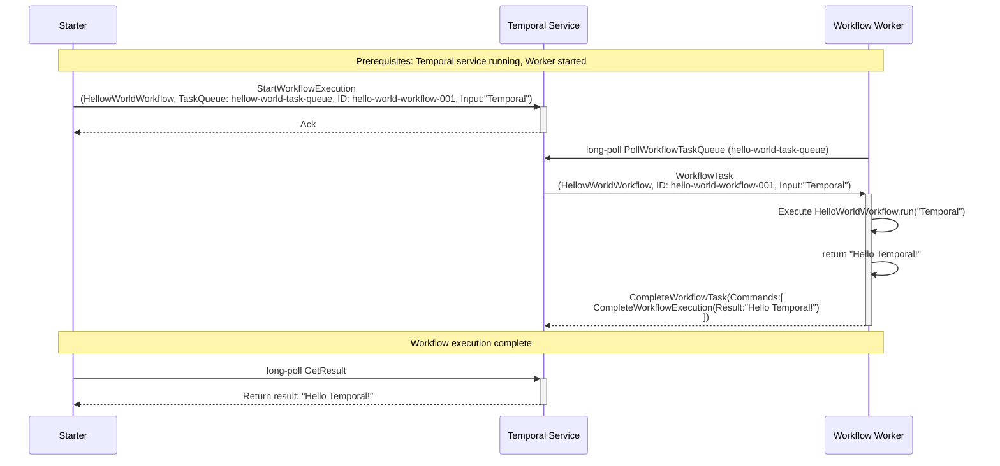

# Temporal Python Hello World Sample

This sample demonstrates the most basic Temporal workflow pattern using Python. It shows how to:

- Define a simple workflow that returns a greeting message
- Create a worker to execute workflows
- Start a workflow execution from a client

## Components

### 1. Workflow (`workflow.py`)
- **HelloWorldWorkflow**: A simple workflow class that returns a personalized greeting
- Demonstrates the basic `@workflow.defn` and `@workflow.run` decorators
- Takes a name parameter and returns "Hello {name}!" string

### 2. Worker (`worker.py`)
- Connects to the Temporal service
- Registers the HelloWorldWorkflow
- Polls the `hello-world-task-queue` for workflow tasks
- Executes workflow instances when tasks are available

### 3. Starter (`starter.py`)
- Creates a Temporal client connection
- Starts a new workflow execution with ID `hello-world-workflow-001`
- Waits for workflow completion and prints the result

## Sequence Diagram

The following diagram shows the interaction flow between components:

## Documentation Index

This sample includes several documentation files explaining different aspects of Temporal workflow execution:

### 📚 Core Documentation
- **[Setup and Running Guide](setup-and-running.md)** - Step-by-step instructions for running this sample
- **[History Events](history-events.md)** - Detailed explanation of workflow history events and their relationship to execution flow
- **[Failure Scenarios](workflow-worker-failure-scenarios.md)** - Analysis of common failure scenarios and how Temporal handles them

### 🚀 Quick Start
To run this sample immediately, see the **[Setup and Running Guide](setup-and-running.md)**.   

## Key Concepts Demonstrated

### Workflow Definition
- **Workflow Decorator**: `@workflow.defn` marks the class as a Temporal workflow
- **Run Method**: `@workflow.run` identifies the main workflow execution method

### Worker Process
- **Task Queue Polling**: Workers poll specific task queues for work
- **Workflow Registration**: Workers must register workflow classes they can execute
- **Concurrent Execution**: Workers can handle multiple workflow instances simultaneously

### Workflow Execution
- **Unique Workflow ID**: Each workflow execution has a unique identifier
- **Task Queue Routing**: Workflows are routed to workers via task queues
- **Result Handling**: Workflow results can be retrieved synchronously

