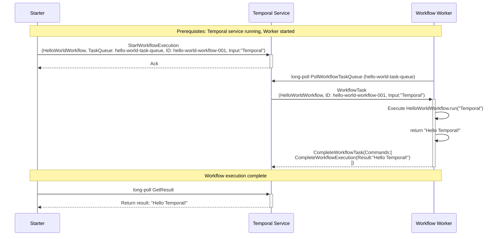

# Temporal Workflow History Events

This document explains the relationship between workflow execution flow and the history events that Temporal generates. Understanding workflow history is crucial for debugging, monitoring, and understanding how Temporal tracks workflow execution.

## Basic Workflow Execution Flow

Here's the sequence diagram showing our HelloWorld workflow execution:



## History Events Generated

For each step in the sequence diagram above, Temporal generates corresponding history events. Here's the complete history for our HelloWorld workflow execution:

### Event 1: WorkflowExecutionStarted
**Triggered by:** `StartWorkflowExecution` call from Starter

```json
{
  "eventId": 1,
  "eventType": "WorkflowExecutionStarted",
  "timestamp": "2024-01-15T10:00:00Z",
  "workflowExecutionStartedEventAttributes": {
    "workflowType": {
      "name": "HelloWorldWorkflow"
    },
    "taskQueue": {
      "name": "hello-world-task-queue"
    },
    "input": {
      "payloads": [
        {
          "data": "\"Temporal\""
        }
      ]
    },
    "workflowExecutionTimeout": "0s",
    "workflowRunTimeout": "0s",
    "workflowTaskTimeout": "10s",
    "originalExecutionRunId": "run-id-123",
    "identity": "starter-client@hostname",
    "firstExecutionRunId": "run-id-123"
  }
}
```

**What it means:** This event records that a new workflow execution has been started with all the initial parameters.

### Event 2: WorkflowTaskScheduled
**Triggered by:** Temporal Service creating the first workflow task. This happens atomically as part of `StartWorkflowExecution` call.

```json
{
  "eventId": 2,
  "eventType": "WorkflowTaskScheduled",
  "timestamp": "2024-01-15T10:00:00.001Z",
  "workflowTaskScheduledEventAttributes": {
    "taskQueue": {
      "name": "hello-world-task-queue"
    },
    "startToCloseTimeout": "10s",
    "attempt": 1
  }
}
```

**What it means:** Temporal has created a workflow task and scheduled it on the specified task queue, waiting for a worker to pick it up.

### Event 3: WorkflowTaskStarted
**Triggered by:** Worker polling and receiving the workflow task

```json
{
  "eventId": 3,
  "eventType": "WorkflowTaskStarted",
  "timestamp": "2024-01-15T10:00:01Z",
  "workflowTaskStartedEventAttributes": {
    "scheduledEventId": 2,
    "identity": "worker@hostname-12345",
    "requestId": "request-uuid-456"
  }
}
```

**What it means:** A worker has picked up the workflow task and started processing it. The `scheduledEventId` references Event 2. Worker identity might be extremely useful for troubleshooting.

### Event 4: WorkflowTaskCompleted
**Triggered by:** Worker completing the workflow task and sending commands

```json
{
  "eventId": 4,
  "eventType": "WorkflowTaskCompleted",
  "timestamp": "2024-01-15T10:00:01.100Z",
  "workflowTaskCompletedEventAttributes": {
    "scheduledEventId": 2,
    "startedEventId": 3,
    "identity": "worker@hostname-12345",
    "binaryChecksum": "checksum-abc123"
  }
}
```

**What it means:** The worker has successfully processed the workflow task and submitted commands (in this case, a command to complete the workflow execution).

### Event 5: WorkflowExecutionCompleted
**Triggered by:** Worker's CompleteWorkflowExecution command. This event is written atomically with `WorkflowTaskCompleted`. 

```json
{
  "eventId": 5,
  "eventType": "WorkflowExecutionCompleted",
  "timestamp": "2024-01-15T10:00:01.101Z",
  "workflowExecutionCompletedEventAttributes": {
    "result": {
      "payloads": [
        {
          "data": "\"Hello Temporal!\""
        }
      ]
    },
    "workflowTaskCompletedEventId": 4
  }
}
```

**What it means:** The workflow execution has completed successfully with the result "Hello Temporal!". The `WorkflowTaskCompletedEventId` references Event 4.

## Event Flow Mapping

Here's how each sequence diagram step maps to history events:

| Sequence Step | History Events Generated | Description |
|---------------|-------------------------|-------------|
| `StartWorkflowExecution` | **Event 1:** WorkflowExecutionStarted<br/>**Event 2:** WorkflowTaskScheduled | Workflow created and first task scheduled |
| `PollWorkflowTaskQueue` | *(No history event)* | Worker polling doesn't generate events |
| `WorkflowTask` delivered | **Event 3:** WorkflowTaskStarted | Worker receives and starts processing task |
| `Execute HelloWorldWorkflow.run()` | *(No history event during execution)* | Workflow code execution buffers commands locally |
| `CompleteWorkflowTask` | **Event 4:** WorkflowTaskCompleted<br/>**Event 5:** WorkflowExecutionCompleted | Task completion and buffered commands (workflow result) |
| `GetResult` | *(No history event)* | Reading results doesn't generate events |

## History Event Characteristics

### Event IDs
- **Sequential**: Event IDs are strictly sequential (1, 2, 3, 4, 5...)
- **Immutable**: Once created, events never change
- **Ordered**: Events maintain strict temporal ordering

### Event Relationships
- **References**: Events often reference other events via `*EventId` fields
- **Causality**: Event relationships show causality chains
- **Grouping**: Related events (like task scheduled → started → completed) form logical groups

### Event Attributes
- **Type-Specific**: Each event type has specific attributes
- **Metadata**: Events contain rich metadata (timestamps, identities, configurations)
- **Payload Data**: Input/output data is stored in events

## Viewing History in Practice

### Using Temporal CLI
```bash
# View workflow history
temporal workflow show \
  --workflow-id hello-world-workflow-001 \
  --address localhost:7233
```

### Using Temporal Web UI
1. Navigate to http://localhost:8233
2. Find your workflow execution
3. Click on "History" tab to see all events

### Using Python SDK
```python
from temporalio.client import Client

async def view_history():
    client = await Client.connect("localhost:7233")
    handle = client.get_workflow_handle("hello-world-workflow-001")
    
    # Get workflow history
    async for event in handle.fetch_history():
        print(f"Event {event.event_id}: {event.event_type}")
        print(f"  Timestamp: {event.event_time}")
        print(f"  Attributes: {event}")
        print()
```

## Practical Applications

### Debugging
- **Replay Issues**: History shows exact sequence of events for debugging
- **Timing Analysis**: Timestamps help identify performance bottlenecks
- **Error Investigation**: Failed events contain error details

### Monitoring
- **Workflow Progress**: Track workflow execution stages
- **Performance Metrics**: Measure task execution times
- **Health Monitoring**: Detect stuck or failing workflows

### Auditing
- **Compliance**: Complete audit trail of workflow execution
- **Forensics**: Investigate what happened during workflow execution
- **Reproducibility**: History enables exact replay of workflow execution


## Key Takeaways

1. **Every Action Creates Events**: All significant workflow actions generate history events
2. **Immutable History**: Once created, history events never change
3. **Complete Audit Trail**: History provides complete record of workflow execution
4. **Debugging Foundation**: History is essential for debugging and troubleshooting
5. **Deterministic Replay**: History enables Temporal's deterministic replay capability

Understanding workflow history is fundamental to working effectively with Temporal and building reliable workflow applications.