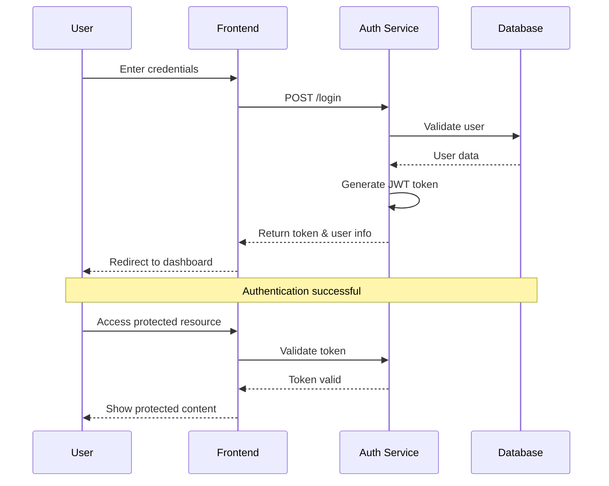
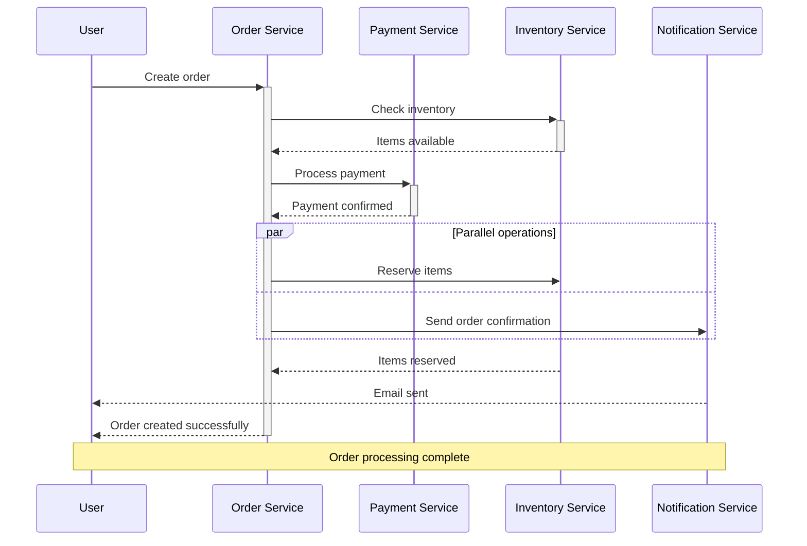

# Sequence Diagram Examples

## User Authentication Flow



## API Request with Error Handling

```mermaid
sequenceDiagram
    participant C as Client
    participant API as API Gateway
    participant S as Service
    participant DB as Database
    
    C->>+API: GET /users/123
    API->>+S: Forward request
    S->>+DB: SELECT user WHERE id=123
    
    alt User exists
        DB-->>-S: User data
        S-->>-API: 200 OK + user data
        API-->>-C: Return user
    else User not found
        DB-->>-S: No results
        S-->>-API: 404 Not Found
        API-->>-C: 404 Error
    else Database error
        DB-->>-S: Connection error
        S-->>-API: 500 Internal Error
        API-->>-C: 500 Error
    end
```

## Microservice Communication



## How to Use

1. Copy any of the above Mermaid code blocks
2. Paste into a GitHub markdown file (`.md`)
3. The diagram will automatically render when viewed on GitHub

## Mermaid Sequence Diagram Features

- **Participants**: Define with `participant` keyword
- **Messages**: Use `->` (solid) or `-->` (dashed) arrows
- **Activation**: Use `+` and `-` for lifeline activation
- **Notes**: Add with `Note over` or `Note left/right of`
- **Alt/Else**: Use `alt`/`else`/`end` for conditional flows
- **Parallel**: Use `par`/`and`/`end` for concurrent operations
- **Loops**: Use `loop`/`end` for repetitive operations

These diagrams will render automatically in GitHub repositories, issues, pull requests, and wikis.